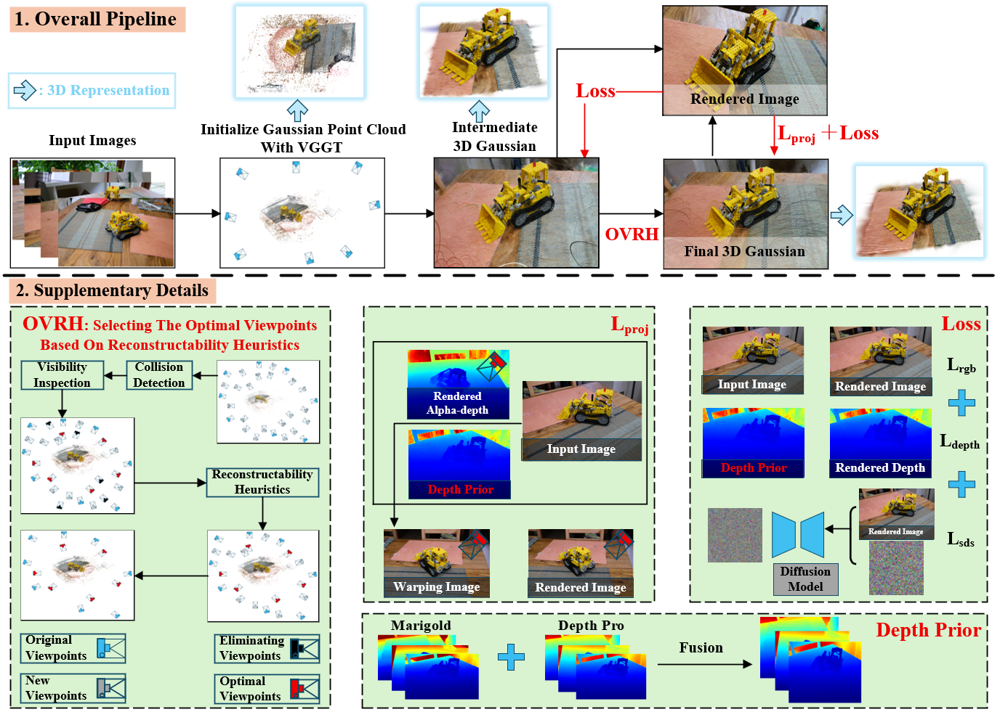
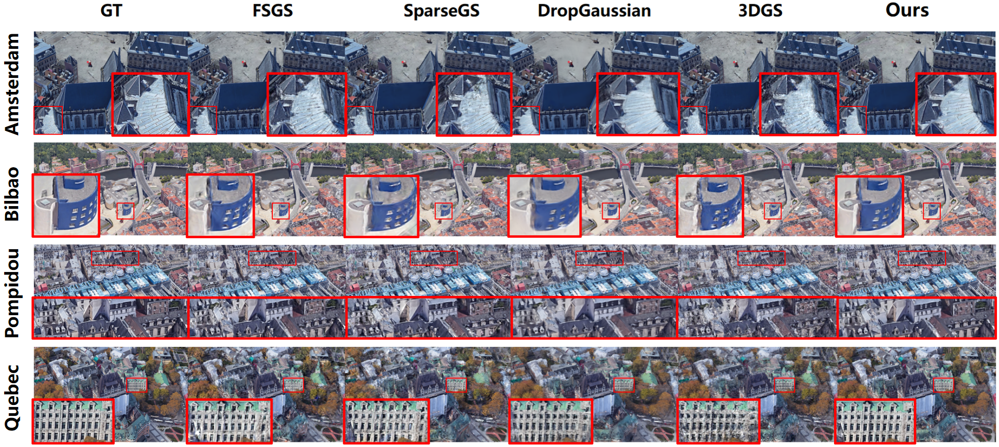
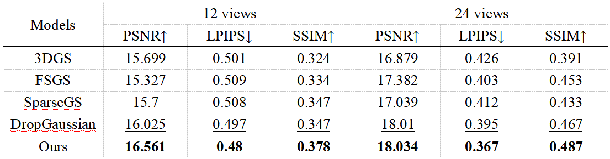

"# OVPGS"

## Framework

## Pipeline

## Results

Fig. 1. Overview of the OVPGS Framework. 1.Overall Pipeline: We first initialize the Gaussian point cloud using VGGT. During the stage1, iterative optimization under the Loss progressively refines the representation, resulting in a dense 3D Gaussian representation. Based on this intermediate representation, During the stage2, OVRH is employed to generate additional viewpoints, which are subsequently incorporated into the following training iterations. Finally, the Gaussian parameters are further optimized under the supervision of the Lproj and Loss, yielding the final 3D Gaussian representation; 2.Supplementary Details: OVRH selects viewpoints with the maximum information gain from the dense Gaussian representation based on a reconstructability strategy. In the Lproj, the warping image is obtained by applying depth-based warping to the input images(Xiong H et al,2025). Moreover, the depth priors used in the two loss computation modules are derived by integrating the depth estimation results from the Marigold and Depth Pro models.
